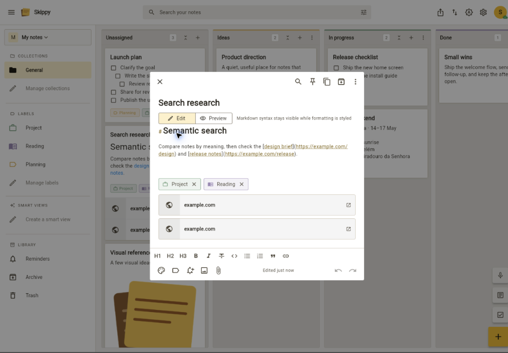
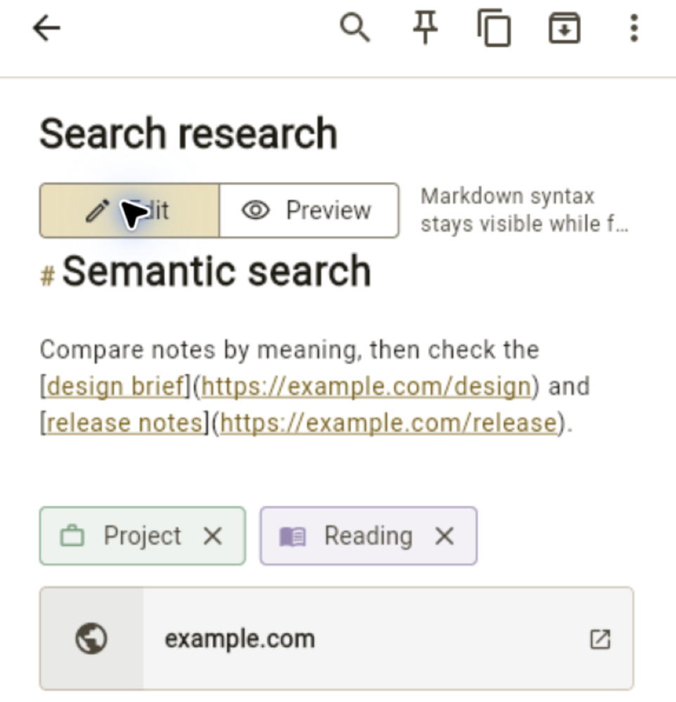

# Skippy

Skippy is a self-hosted notes app for the web, iOS, Android, macOS, and
Windows. It supports offline work, collaboration, and optional AI services.

The full documentation is an [MkDocs Material site](mkdocs-material/docs/index.md). Start
it with:

```sh
docker compose up -d docs
```

Open <http://localhost:8123>. The app itself remains available at
<http://localhost:8787>.

## Screenshots

[](mkdocs-material/docs/assets/screenshots/skippy-desktop-masonry.png)

[](mkdocs-material/docs/assets/screenshots/skippy-desktop-board-features.png)

[](mkdocs-material/docs/assets/screenshots/skippy-desktop-editor.png)

[](mkdocs-material/docs/assets/screenshots/skippy-mobile-overview.png)

[](mkdocs-material/docs/assets/screenshots/skippy-mobile-editor.png)
