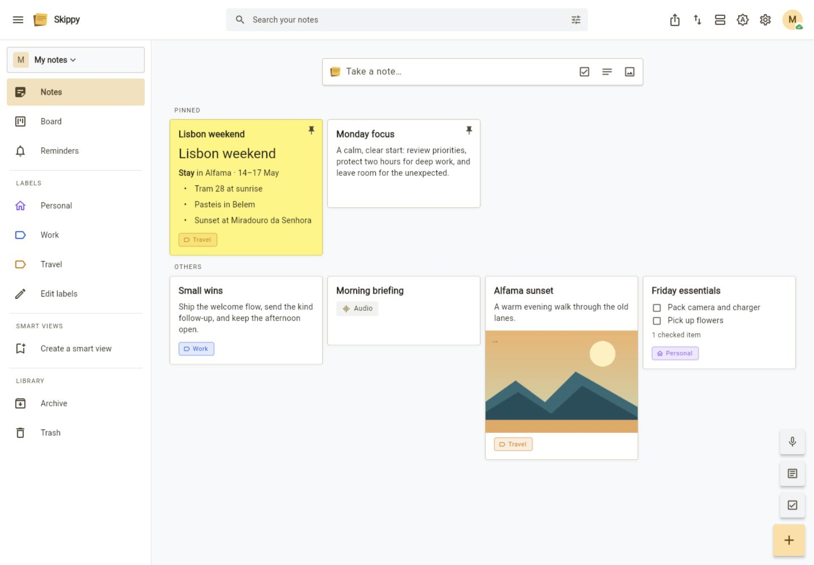
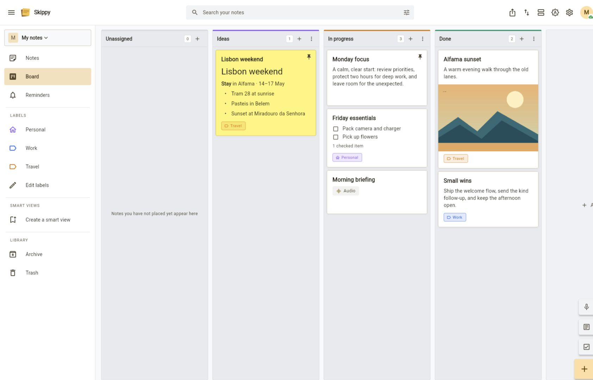
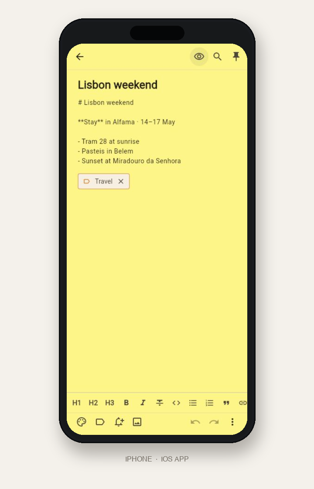

# Skippy

Skippy is a cross-platform notes app with a Flutter client and a Rust/axum
backend. It supports web, iOS, and Android, with SQLite persistence and
optimistic, offline-capable edits.

## Features

- Text, Markdown, checklist, audio, and attachment notes
- Grid, list, and kanban board views with drag-to-reorder
- Workspaces, labels, stages, archive, trash, time and location reminders,
  search, and exports
- Sharing, public read-only links, live sync, and version history
- Optional self-hosted Whisper transcription, Tesseract image text recognition,
  and OpenAI-compatible embeddings
- Optional LLM features: automatic labels, note editing, and notes chat
- Dark mode, responsive layouts, keyboard shortcuts, share-sheet intake, and
  home-screen widgets

## Screenshots

<table>
  <tr>
    <td></td>
    <td></td>
  </tr>
  <tr>
    <td></td>
    <td></td>
  </tr>
  <tr>
    <td></td>
    <td></td>
  </tr>
</table>

On Android and iOS, adding an image offers the camera alongside the photo
library, so a receipt or a whiteboard goes straight from the lens onto a note.
Uploaded images are read for text when an OCR service is configured, so that
photo is found again by the words in it. Recognition runs in the background,
feeds both keyword and semantic search, and never blocks the upload.

On Android and iOS, Settings can hold personal saved places such as Home or
Work. A note can then raise a one-shot notification when the device arrives at
or leaves one of those places, even while Skippy is closed. Location reminders
require notification and background-location permission; saved coordinates
are user settings and are never exposed to note collaborators.

The app is deliberately out of scope for drawings, calendar sync, and
CRDT-style collaboration. Collaboration uses last-write-wins at note level.

## Quick start with Docker

Generate credentials before the first start. Copy each output line into `.env`:

```sh
access_key="GK$(openssl rand -hex 16)"
secret_key="$(openssl rand -hex 32)"
printf 'GARAGE_RPC_SECRET='; openssl rand -hex 32
printf 'S3_ACCESS_KEY=%s\n' "$access_key"
printf 'GARAGE_DEFAULT_ACCESS_KEY=%s\n' "$access_key"
printf 'S3_SECRET_KEY=%s\n' "$secret_key"
printf 'GARAGE_DEFAULT_SECRET_KEY=%s\n' "$secret_key"
```

Keep `.env` private. Keep matching `S3_*` and `GARAGE_DEFAULT_*`
values unchanged after Garage setup.

```sh
docker compose up -d
```

Open <http://localhost:8787>. The image builds the Flutter web app and Rust
server. The stack also starts Whisper for audio transcription, Tesseract for
reading text out of uploaded images, and Garage for optional S3-compatible
attachment storage. SQLite data and attachments persist in the `app_data`
volume.

The current database schema has no in-place migration path. Start with a new
database when installing a schema revision.

Disk storage is the default. To use the bundled Garage service instead:

```sh
STORAGE=s3 docker compose up -d
```

Compose requires `GARAGE_RPC_SECRET`, `S3_ACCESS_KEY`, `S3_SECRET_KEY`,
`GARAGE_DEFAULT_ACCESS_KEY`, and
`GARAGE_DEFAULT_SECRET_KEY` in `.env`; no default credentials are provided.
The S3 access and secret values must match their corresponding Garage values.
Choose one attachment backend per deployment; switching does not migrate
existing blobs.

To run only the supporting services during local backend development:

```sh
docker compose up -d whisper tesseract garage
```

See [Deployment](docs/DEPLOY.md) for production and optional GPU Whisper
settings.

## Configuration

All server settings are optional. The defaults work for a local Docker
deployment.

| Variable | Default | Purpose |
| --- | --- | --- |
| `ADDR` | `0.0.0.0:8787` | Listen address |
| `DB` | `sticky_notes.db` | SQLite path (`/data/sticky_notes.db` in Docker) |
| `UPLOADS` | `uploads` | Disk attachment directory |
| `PUBLIC_URL` | unset | Browser API URL and allowed CORS origin |
| `STORAGE` | `disk` | `disk` or `s3` |
| `WHISPER_URL` | unset | Whisper service URL; Docker sets it to `http://whisper:9000` |
| `OCR_URL` | unset | Tesseract service URL; enables text search inside images. Docker sets it to `http://tesseract:8884` |
| `OCR_LANGUAGES` | `eng` | Tesseract language packs, e.g. `fra+eng`; the pack must exist in the OCR image |
| `EMBED_URL` | unset | OpenAI-compatible embeddings URL; enables semantic search and chat |
| `EMBED_MODEL` | `bge-m3` | Embedding model |
| `EMBED_API_KEY` | unset | Embedding service bearer token |
| `S3_URL` | unset | Required when storage is `s3` |
| `S3_ACCESS_KEY` | unset | Required when storage is `s3` |
| `S3_SECRET_KEY` | unset | Required when storage is `s3` |
| `S3_REGION` | `garage` | S3 signing region |
| `S3_BUCKET_PREFIX` | `sticky-notes-` | Prefix for per-user buckets |
| `ALLOW_PRIVATE_USER_ENDPOINTS` | off | Allow user-configured AI/notification URLs on private networks |
| `UNFURL_ALLOW_PRIVATE` | off | Allow link previews for private/loopback hosts |
| `TELEGRAM_API` | `https://api.telegram.org` | Telegram API base URL |

LLM providers are configured per user in Settings. The server does not use
LLM environment variables.

### Docker Compose environment variables

This table lists every variable passed by Compose. `host/.env` values come from
the shell or `.env`; optional entries are commented in `docker-compose.yml`.

| Service | Variable | Compose value or host input | Purpose |
| --- | --- | --- | --- |
| server | `PUBLIC_URL` | host/.env; empty by default | Public browser URL and allowed CORS origin. |
| server | `EMBED_URL` | host/.env; empty by default | OpenAI-compatible embeddings endpoint. |
| server | `EMBED_MODEL` | host/.env; `bge-m3` by default | Embedding model name. |
| server | `EMBED_API_KEY` | host/.env; empty by default | Bearer token for the embeddings endpoint. |
| server | `WHISPER_URL` | `http://whisper:9000` | Bundled Whisper service URL. |
| server | `OCR_URL` | `http://tesseract:8884` | Bundled Tesseract service URL. |
| server | `OCR_LANGUAGES` | host/.env; `eng` by default | Tesseract language packs used to read images. |
| server | `STORAGE` | host/.env; `disk` by default | Attachment backend: `disk` or `s3`. |
| server | `S3_URL` | `http://garage:3900` | Bundled Garage S3 endpoint. |
| server | `S3_REGION` | `garage` | S3 signing region. |
| server | `S3_ACCESS_KEY` | required host/.env value | S3 access key; must match Garage’s default access key. |
| server | `S3_SECRET_KEY` | required host/.env value | S3 secret; must match Garage’s default secret. |
| server | `ALLOW_PRIVATE_USER_ENDPOINTS` | host/.env; empty by default | Allows user-configured AI/notification URLs on private networks. |
| server (optional) | `UNFURL_ALLOW_PRIVATE` | commented example: `1` | Allows link previews for private/loopback hosts. |
| server (optional) | `TELEGRAM_API` | commented example: `https://api.telegram.org` | Telegram API base URL. |
| whisper | `ASR_MODEL` | `base` (`large-v3` for GPU) | Whisper model to load. |
| whisper | `ASR_ENGINE` | `faster_whisper` | Whisper inference engine. |
| whisper (GPU) | `ASR_DEVICE` | `cuda` | Runs inference on an NVIDIA GPU. |
| whisper (GPU) | `ASR_QUANTIZATION` | `float16` | GPU model quantization. |
| garage | `GARAGE_RPC_SECRET` | required host/.env value | Garage cluster RPC secret. |
| garage | `GARAGE_DEFAULT_ACCESS_KEY` | required host/.env value | Default Garage access key; must match the server’s S3 access key. |
| garage | `GARAGE_DEFAULT_SECRET_KEY` | required host/.env value | Default Garage secret key; must match the server’s S3 secret key. |
| garage | `GARAGE_DEFAULT_BUCKET` | `sticky-notes-default` | Bucket created for Garage's single-node mode. |

The Flutter app uses build-time defines rather than runtime environment
variables:

```sh
--dart-define=API_BASE=http://localhost:8787
--dart-define=SKIPPY_CLIENT_VERSION=<version>
```

## Local development

Prerequisites: Rust 1.88+ and Flutter 3.44+ / Dart 3.12+.

Run the backend:

```sh
cd backend
cargo run
```

Run the Flutter app:

```sh
cd app
flutter run -d chrome
flutter run -d <ios-or-android-id>
```

The default backend is `http://localhost:8787`. On an Android emulator use
`http://10.0.2.2:8787`; on a physical device use the host machine's LAN IP.
The login screen can also save and switch between server URLs.

For a single-binary web deployment:

```sh
cd app && flutter build web --release
cd ../backend && cargo run
```

The backend serves `app/build/web` when it contains `index.html`.

## Mobile release builds

Update the version in `app/pubspec.yaml`, then run from `app/`:

```sh
flutter pub get
flutter build appbundle --release --dart-define=API_BASE=https://notes.example.com
flutter build ipa --release --dart-define=API_BASE=https://notes.example.com
```

The Android App Bundle is written to
`app/build/app/outputs/bundle/release/app-release.aab`; an APK can be built with
`flutter build apk --release`. The iOS archive and IPA are written under
`app/build/ios/`.

Android currently uses the debug signing key in
`app/android/app/build.gradle.kts`. Configure a private upload keystore before
publishing to Google Play. iOS distribution requires macOS/Xcode signing with
an Apple team and provisioning profile.

## User backups

Settings lets each user create and restore a portable backup of their own
workspaces. This remains separate from the server and Docker deployment.

## Tests

```sh
cd backend && cargo test
cd backend && cargo clippy --all-targets -- -D warnings
cd app && flutter test
cd app && flutter analyze
```

Backend tests use in-memory SQLite and deterministic service fakes. Flutter
tests use `FakeApi` and cover models, stores, offline sync, settings, and key
widget flows.

## Repository layout

```text
backend/  Rust API, SQLite repository, file storage, optional services
app/      Flutter client, state stores, screens, widgets, platform adapters
docs/     Deployment notes and historical design documents
```

The main extension seams are the `Repository` in
[`backend/src/store/mod.rs`](backend/src/store/mod.rs) and the `FileStore` in
[`backend/src/files.rs`](backend/src/files.rs). SQLite and local disk are the
defaults; S3-compatible storage is also supported.

## API overview

Authenticated JSON endpoints live under `/api`. The main groups are:

- `/auth`, `/workspaces`, `/notes`, `/labels`, and `/stages`
- `/notes/{id}/versions`, `/notes/{id}/attachments`, and sharing endpoints
- `/search`, `/chat`, `/settings`, `/unfurl`, and `/ws`
- `/health` and `/capabilities` for service status

Attachments are served through signed, expiring URLs. Optional search,
transcription, image text recognition, and LLM routes report unavailable
services instead of requiring them at startup.
