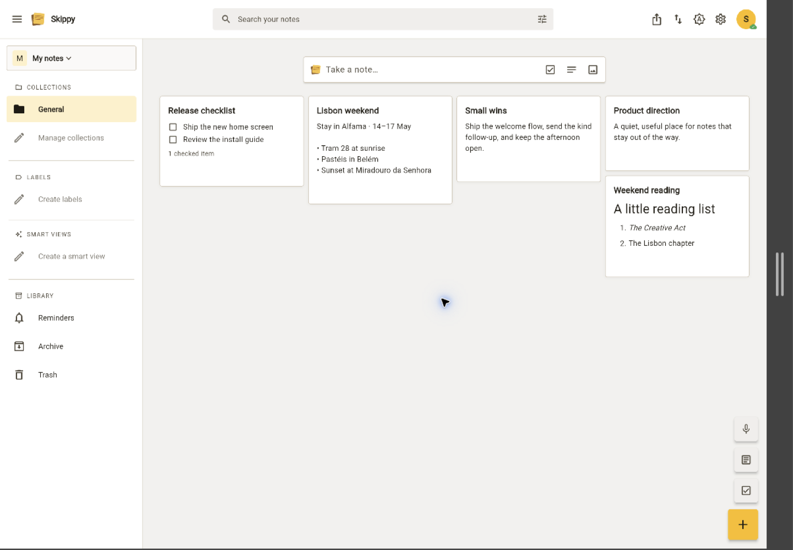
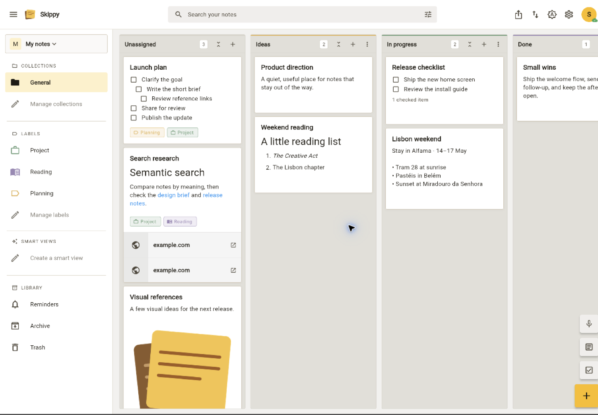
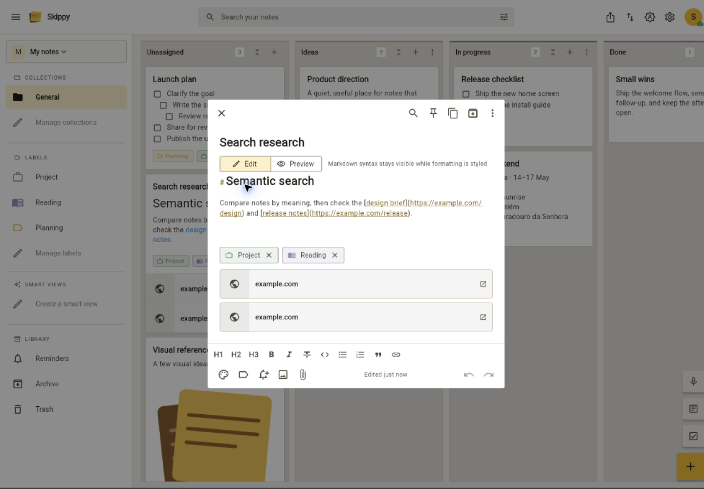
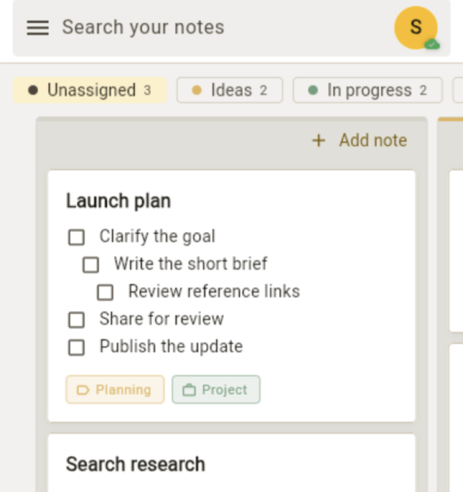
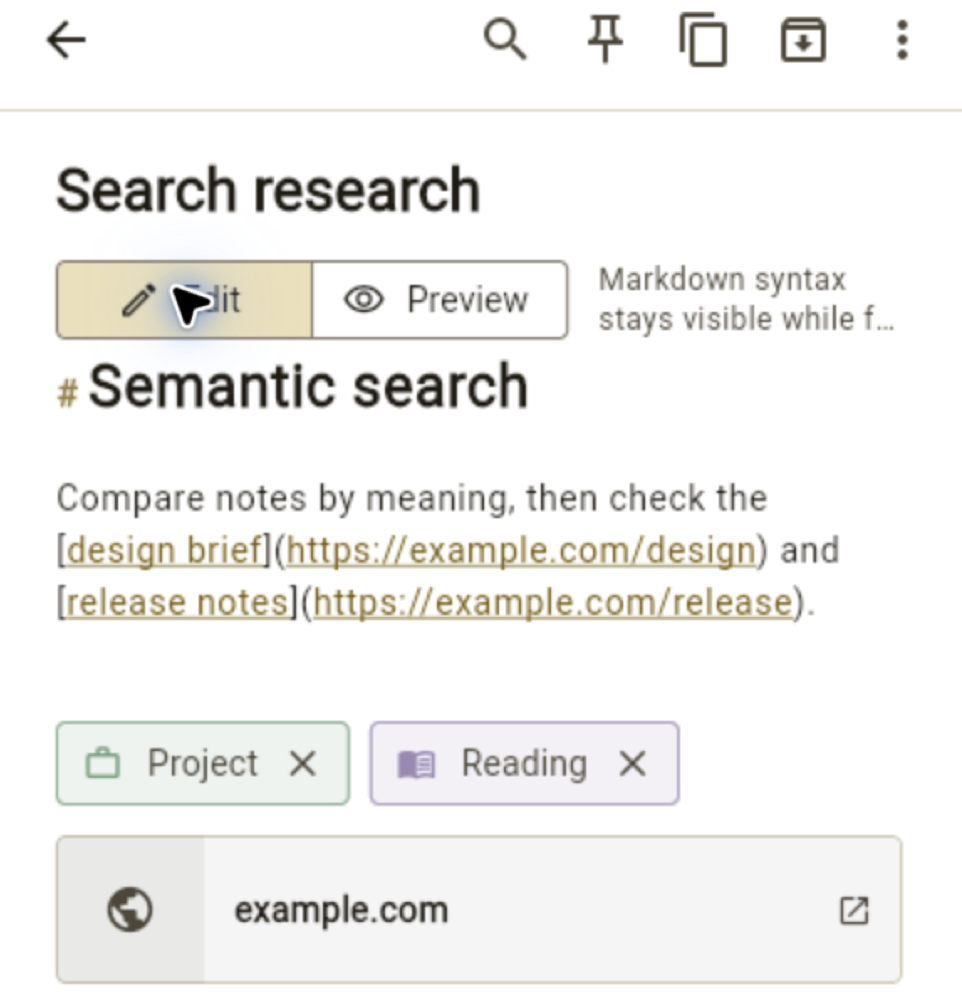

# Skippy

Skippy is a self-hosted notes app for the web, iOS, Android, macOS, and
Windows. It works offline and syncs when a device reconnects.

## Features

- Text, Markdown, checklist, and audio notes with files, images, and links.
- Links between notes: type `[[` in a note to link another, and each note
  lists the notes linking to it.
- Workspaces, collections, labels, boards, reminders, search, and backups.
- Import from Google Keep: in Settings, open Backup & import, choose Import
  from Google Keep, and pick the Keep zip from
  [Google Takeout](https://takeout.google.com).
- Real-time collaboration and offline edits.
- Optional transcription, image text recognition, semantic search, and AI
  tools. The owner of a workspace sets up the AI once, and everyone in the
  workspace uses it. See [AI in a workspace](setup.md#ai-in-a-workspace).
- An MCP server for AI assistants such as Claude. See
  [Connect an AI assistant](setup.md#connect-an-ai-assistant).

## Screenshots

- 

- 

- 

- 

- 

!!! note "Mobile availability"

    Android needs more testers before a public release. The iOS app is not in
    the App Store yet. Both can be installed directly; direct iOS installs
    need refreshing every seven days.

Start with [Set up Skippy](setup.md).
