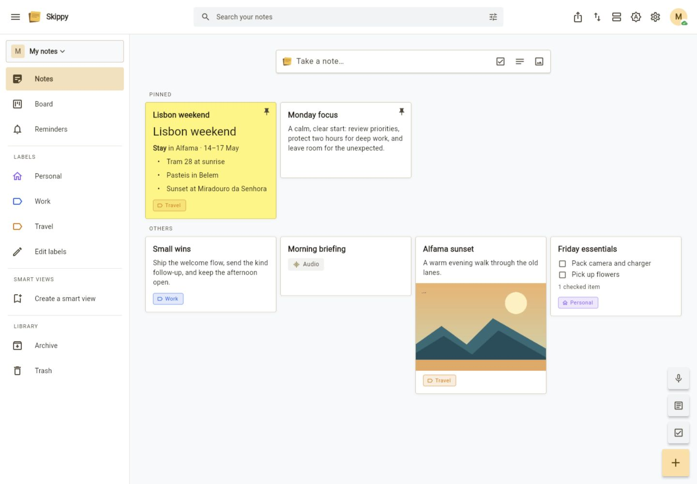
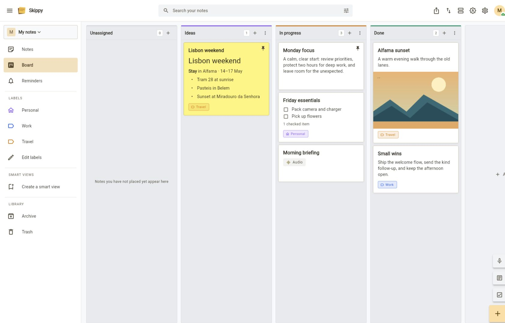
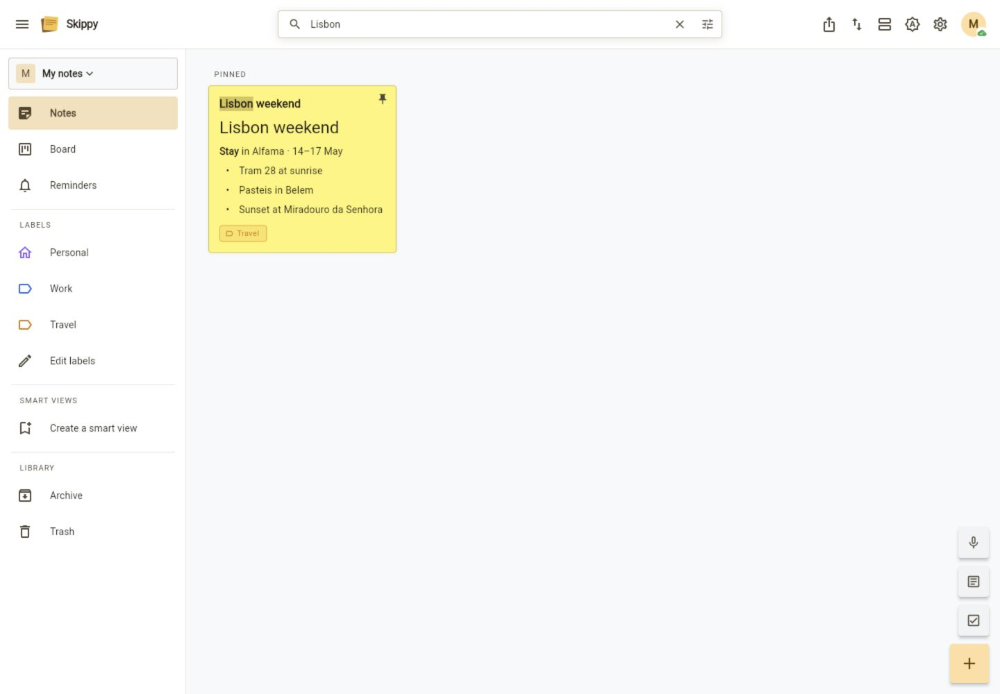
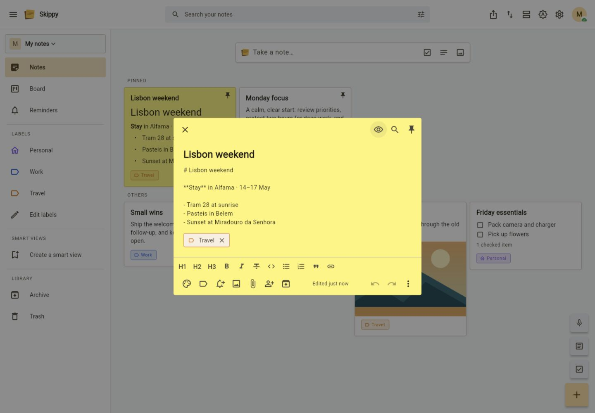
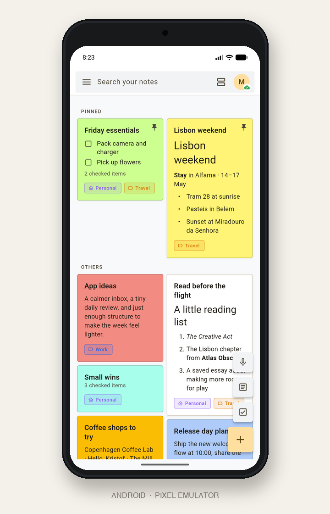

# Skippy

Skippy is a notes app you can host yourself. It works on the web, iOS,
Android, macOS, and Windows. Notes stay usable while a device is offline and
sync when it reconnects.

## Features

- Write text, Markdown, checklist, and audio notes. Add files, images, and
  links with previews.
- Make nested checklists with reminders for a note or an individual task.
- Organize notes in workspaces and collections. Use a grid, list, or board;
  resize cards, add labels, and save useful filters.
- Find notes with text search. Optional image reading and semantic search also
  search image text and related content.
- Share workspaces or individual notes, create public read-only links, and see
  changes from other participants.
- Set time or location reminders. Notifications can use the device, ntfy,
  Telegram, or email.
- Restore a note from its version history, archive or trash it, and make
  exports, workspace copies, and backups.
- Use mobile sharing, home-screen widgets, dark mode, responsive layouts, and
  keyboard shortcuts where the platform supports them.
- Add optional AI tools for link summaries, automatic labels, configurable
  rewrite actions, and chat with your notes.
- Enable email password reset when the deployment has a mail server.

> Mobile app availability: Android needs more testers before a public release.
> The iOS app is not yet in the App Store, but is planned. Both apps can be
> installed directly; a direct iOS installation must be refreshed every seven
> days.

## Screenshots

<table>
  <tr>
    <td></td>
    <td></td>
  </tr>
  <tr>
    <td></td>
    <td></td>
  </tr>
  <tr>
    <td></td>
    <td></td>
  </tr>
</table>

## Technical overview

The client is Flutter. The server is Rust with axum and SQLite. The server can
also serve the built web client, so a small deployment is one container and one
persistent volume.

Edits are applied locally first and queued for sync. Collaboration uses
last-write-wins at note level; it does not use CRDTs. Attachments use local disk
storage by default and can use S3-compatible storage instead.

Whisper transcription, Tesseract image text recognition, embeddings, and an
OpenAI-compatible LLM are optional services. The app still works without them.
Drawings and calendar sync are not included.

## Quick start with Docker

Skippy is published as `ghcr.io/lucasgenoud/skippy:latest`. The smallest
deployment is one service and one volume. Save this as `docker-compose.yml`
and run `docker compose up -d`:

```yaml
services:
  server:
    image: ghcr.io/lucasgenoud/skippy:latest
    ports:
      - "8787:8787"
    volumes:
      - app_data:/data
    restart: unless-stopped

volumes:
  app_data:
```

The Compose files in this repository run the same image with every setting
spelled out:

```sh
docker compose up -d
docker compose -f docker-compose.yml -f docker-compose.simple.yml up -d
docker compose -f docker-compose.yml -f docker-compose.simple.yml -f docker-compose.all.yml up -d
```

`docker-compose.yml` runs Skippy with disk storage.
`docker-compose.simple.yml` adds Whisper and Tesseract while keeping disk
storage. `docker-compose.all.yml` is the full stack and uses Garage for S3
storage.

For the full stack, generate credentials before the first start. Copy each
output line into `.env`:

```sh
access_key="GK$(openssl rand -hex 16)"
secret_key="$(openssl rand -hex 32)"
printf 'GARAGE_RPC_SECRET='; openssl rand -hex 32
printf 'S3_ACCESS_KEY=%s\n' "$access_key"
printf 'GARAGE_DEFAULT_ACCESS_KEY=%s\n' "$access_key"
printf 'S3_SECRET_KEY=%s\n' "$secret_key"
printf 'GARAGE_DEFAULT_SECRET_KEY=%s\n' "$secret_key"
```

Keep `.env` private. Keep matching `S3_*` and `GARAGE_DEFAULT_*`
values unchanged after Garage setup.

Open <http://localhost:8787> to use the app. Set `LANDING_PAGE=true` to show
the landing page at `/`, with the app then available at `/app/`. The image
bundles the Flutter web app and the Rust server. SQLite data persists in the
`app_data` volume. Disk-storage deployments also keep attachments there; the
full stack stores attachments in Garage.

To build the image yourself rather than pull it:

```sh
docker build -t ghcr.io/lucasgenoud/skippy:latest .
```

The collections upgrade migrates the current workspace-owned database in place
on startup. Each workspace's existing notes and board columns go into a regular
**General** collection; board-only workspaces keep a board layout. The migration
is transactional and runs once. Older schemas from before workspace ownership
still require a compatible workspace backup or a fresh installation.

The full stack requires `GARAGE_RPC_SECRET`, `S3_ACCESS_KEY`, `S3_SECRET_KEY`,
`GARAGE_DEFAULT_ACCESS_KEY`, and
`GARAGE_DEFAULT_SECRET_KEY` in `.env`; no default credentials are provided.
The S3 access and secret values must match their corresponding Garage values.
Choose one attachment backend per deployment; switching does not migrate
existing blobs.

See [Deployment](deployment.md) for production and optional GPU Whisper
settings.

## Configuration

All server settings are optional. The defaults work for a local Docker
deployment.

| Variable | Default | Purpose |
| --- | --- | --- |
| `ADDR` | `0.0.0.0:8787` | Listen address |
| `DB` | `sticky_notes.db` | SQLite path (`/data/sticky_notes.db` in Docker) |
| `UPLOADS` | `uploads` | Disk attachment directory |
| `WEB` | `../app/build/web` | Directory containing the built Flutter web app |
| `PUBLIC_URL` | unset | Browser API URL and allowed CORS origin |
| `LANDING_PAGE` | `false` | Set to `true` to serve the landing and setup pages at `/` and the Flutter app at `/app/` |
| `STORAGE` | `disk` | `disk` or `s3` |
| `WHISPER_URL` | unset | Whisper service URL; Docker sets it to `http://whisper:9000` |
| `OCR_URL` | unset | Tesseract service URL; enables text search inside images. Docker sets it to `http://tesseract:8884` |
| `OCR_LANGUAGES` | `eng` | Tesseract language packs, e.g. `fra+eng`; the pack must exist in the OCR image |
| `EMBED_URL` | unset | OpenAI-compatible embeddings URL; enables semantic search and chat |
| `EMBED_MODEL` | `bge-m3` | Embedding model |
| `EMBED_API_KEY` | unset | Embedding service bearer token |
| `S3_URL` | unset | Required when storage is `s3` |
| `S3_ACCESS_KEY` | unset | Required when storage is `s3` |
| `S3_SECRET_KEY` | unset | Required when storage is `s3` |
| `S3_REGION` | `garage` | S3 signing region |
| `S3_BUCKET_PREFIX` | `sticky-notes-` | Prefix for per-user buckets |
| `ALLOW_PRIVATE_USER_ENDPOINTS` | off | Allow user-configured AI/notification endpoints (including a LAN mail server) on private networks |
| `UNFURL_ALLOW_PRIVATE` | off | Allow link previews for private/loopback hosts |
| `TELEGRAM_API` | `https://api.telegram.org` | Telegram API base URL |

LLM providers are configured per user in Settings. Setting any of these
env vars overrides that user setting and locks the field in the app:

```text
LLM_BASE_URL
LLM_API_KEY       # secret; never returned to the app
LLM_MODEL
LLM_LABELING      # true/false
LLM_CHAT          # true/false
LLM_WRITING       # true/false
```

Email reminders work the same way. A deployment with its own mail server pins
it once, and each user then only fills in the address to send to:

```text
SMTP_HOST
SMTP_PORT         # optional; defaults to 465, 587, or 25 to match SMTP_SECURITY
SMTP_SECURITY     # tls (default), starttls, or none
SMTP_USERNAME
SMTP_PASSWORD     # secret; never returned to the app
SMTP_FROM         # defaults to SMTP_USERNAME
```

Pinning the mail server also switches on password reset. Once `SMTP_HOST` and
a sender (`SMTP_FROM`, or `SMTP_USERNAME` standing in for it) are set and
`PUBLIC_URL` says where the deployment answers, the login screen offers
"Forgot password?" and the server emails a one-shot link that expires in an
hour. The link is built from `PUBLIC_URL`, never from the request's `Host`
header, so a stranger cannot aim it somewhere else. Redeeming it also signs
every existing session out of that account. Leave either variable unset and
the option stays hidden; the server reports it on `/api/capabilities` as
`password_reset`.

Leave a variable unset to keep that field the user's own. The override is
applied server-side on every read, so it holds regardless of what a client
stores.

### Docker Compose environment variables

This table lists every variable passed by the Compose variants. `host/.env`
values come from the shell or `.env`.

| Service | Variable | Compose value or host input | Purpose |
| --- | --- | --- | --- |
| server | `PUBLIC_URL` | host/.env; empty by default | Public browser URL, allowed CORS origin, and the base of emailed password reset links. |
| server | `LANDING_PAGE` | host/.env; `false` by default | Set `true` to serve the landing page at `/` and the Flutter app at `/app/`. |
| server | `EMBED_URL` | host/.env; empty by default | OpenAI-compatible embeddings endpoint. |
| server | `EMBED_MODEL` | host/.env; `bge-m3` by default | Embedding model name. |
| server | `EMBED_API_KEY` | host/.env; empty by default | Bearer token for the embeddings endpoint. |
| server | `WHISPER_URL` | simple/all: `http://whisper:9000` | Bundled Whisper service URL. |
| server | `OCR_URL` | simple/all: `http://tesseract:8884` | Bundled Tesseract service URL. |
| server | `OCR_LANGUAGES` | simple/all; host/.env; `eng` by default | Tesseract language packs used to read images. |
| server | `STORAGE` | minimal/simple: `disk`; all: `s3` | Attachment backend. |
| server | `S3_URL` | all: `http://garage:3900` | Bundled Garage S3 endpoint. |
| server | `S3_REGION` | all: `garage` | S3 signing region. |
| server | `S3_ACCESS_KEY` | all; required host/.env value | S3 access key; must match Garage’s default access key. |
| server | `S3_SECRET_KEY` | all; required host/.env value | S3 secret; must match Garage’s default secret. |
| server | `ALLOW_PRIVATE_USER_ENDPOINTS` | host/.env; empty by default | Allows user-configured AI/notification URLs on private networks. |
| server (optional) | `LLM_BASE_URL` | host/.env; empty by default | Server-managed LLM base URL; locks the field in the app. |
| server (optional) | `LLM_API_KEY` | host/.env; empty by default | Server-managed LLM API key; never returned to the app. |
| server (optional) | `LLM_MODEL` | host/.env; empty by default | Server-managed LLM model. |
| server (optional) | `LLM_LABELING` | host/.env; empty by default | Forces automatic labeling on or off. |
| server (optional) | `LLM_CHAT` | host/.env; empty by default | Forces notes chat on or off. |
| server (optional) | `LLM_WRITING` | host/.env; empty by default | Forces AI note editing on or off. |
| server (optional) | `SMTP_HOST` | host/.env; empty by default | Server-managed mail server for email reminders and password reset; locks the field in the app. |
| server (optional) | `SMTP_PORT` | host/.env; empty by default | Mail server port; blank follows `SMTP_SECURITY`. |
| server (optional) | `SMTP_SECURITY` | host/.env; `tls` by default | `tls`, `starttls`, or `none`. |
| server (optional) | `SMTP_USERNAME` | host/.env; empty by default | Mail account to authenticate as. |
| server (optional) | `SMTP_PASSWORD` | host/.env; empty by default | Mail account password; never returned to the app. |
| server (optional) | `SMTP_FROM` | host/.env; empty by default | Address reminders and password reset links are sent from. |
| whisper | `ASR_MODEL` | `base` (`large-v3` for GPU) | Whisper model to load. |
| whisper | `ASR_ENGINE` | `faster_whisper` | Whisper inference engine. |
| whisper (GPU) | `ASR_DEVICE` | `cuda` | Runs inference on an NVIDIA GPU. |
| whisper (GPU) | `ASR_QUANTIZATION` | `float16` | GPU model quantization. |
| garage | `GARAGE_RPC_SECRET` | required host/.env value | Garage cluster RPC secret. |
| garage | `GARAGE_DEFAULT_ACCESS_KEY` | required host/.env value | Default Garage access key; must match the server’s S3 access key. |
| garage | `GARAGE_DEFAULT_SECRET_KEY` | required host/.env value | Default Garage secret key; must match the server’s S3 secret key. |
| garage | `GARAGE_DEFAULT_BUCKET` | `sticky-notes-default` | Bucket created for Garage's single-node mode. |

The Flutter app uses build-time defines rather than runtime environment
variables:

```sh
--dart-define=API_BASE=http://localhost:8787
--dart-define=SKIPPY_CLIENT_VERSION=<version>
```

## Local development

Prerequisites: Rust 1.88+ and Flutter 3.44+ / Dart 3.12+.

Run the backend:

```sh
cd backend
cargo run
```

Run the Flutter app:

```sh
cd app
flutter run -d chrome --dart-define=API_BASE=http://localhost:8787
flutter run -d macos --dart-define=API_BASE=http://localhost:8787
flutter run -d windows --dart-define=API_BASE=http://localhost:8787
flutter run -d <ios-or-android-id> --dart-define=API_BASE=http://localhost:8787
```

Release builds default to `https://skippy-notes.com`. For local development,
pass the `API_BASE` define shown above. On an Android emulator use
`http://10.0.2.2:8787`; on a physical device use the host machine's LAN IP.
The login screen can also save and switch between server URLs.

For a single-binary web deployment:

```sh
cd app && flutter build web --release
cd ../backend && cargo run
```

The backend serves `app/build/web` when it contains `index.html`.

## Mobile release builds

Update the version in `app/pubspec.yaml`, then run from `app/`:

```sh
flutter pub get
flutter build appbundle --release --dart-define=API_BASE=https://notes.example.com
flutter build ipa --release --dart-define=API_BASE=https://notes.example.com
```

The Android App Bundle is written to
`app/build/app/outputs/bundle/release/app-release.aab`; an APK can be built with
`flutter build apk --release`. The iOS archive and IPA are written under
`app/build/ios/`.

Android release builds use a private upload keystore configured through the
ignored `app/android/key.properties` file. Before building a Play Store
release, create it with the following values (do not commit or share it):

```text
storePassword=<keystore password>
keyPassword=<key password>
keyAlias=skippy-upload
storeFile=signing/skippy-upload.jks
```

Keep the corresponding keystore in the ignored `app/android/signing/`
directory and back it up securely. iOS distribution requires macOS/Xcode
signing with an Apple team and provisioning profile.

## Desktop release builds

```sh
flutter build macos --release --dart-define=API_BASE=https://notes.example.com
flutter build windows --release --dart-define=API_BASE=https://notes.example.com
```

`Skippy.app` is written to `app/build/macos/Build/Products/Release/`, and the
Windows build to `app/build/windows/x64/runner/Release/`. Each has to be built
on its own operating system.

The macOS app runs sandboxed. `macos/Runner/*.entitlements` grant outgoing
network access (the backend, map tiles, the configured LLM), the microphone for
audio notes, and read/write on files the user picks in a dialog. Shipping it
outside your own machines also needs Developer ID signing and notarization.

Two things differ from mobile on the desktop:

- Exports and attachment downloads open a save dialog rather than the share
  sheet, since there is a filesystem to aim at.
- Audio notes record and transcribe everywhere, but playback needs `just_audio`,
  which has no Windows implementation. The Windows build shows a short note in
  place of the player instead of a dead play button.

The features that only exist on a phone stay switched off by platform checks:
home-screen widgets, the share-sheet intake, and the camera option when adding
an image.

Location reminders are the exception that is only half a phone feature. Only a
phone can watch a geofence, but the saved places and the reminders pinned to
them live in the account's settings document, so any platform can set one and
the phone arms it on its next sync. The reminder picker says as much wherever
the device itself is not the one watching.

## Data model and sharing

Each workspace contains independent collections. Every note belongs to one
collection, whose settings define its name, icon, color, default sorting and
masonry, list or board layout. Workspace members share those settings and may
create, edit or delete collections. Columns belong to a collection; moving a
note to another collection clears its column and keeps its workspace labels.

General is an ordinary collection, not an inbox. Deleting a collection sends
its notes to workspace trash for the existing seven-day retention period.
Restoring those notes requires choosing an existing collection. Archive,
reminders and trash still span the workspace.

Labels and smart views are workspace-wide filters applied inside the current
collection. Every member can create, edit, reorder or delete smart views. Existing personal smart views are imported once into
their owner's default workspace on server startup. Personal appearance,
notification accounts and saved locations remain user settings.

Workspace settings offer duplication to every member: copy the structure
(collections, layouts, columns, labels and smart filters), or include notes and
attachments too. Archived notes are included; trash, version history, members,
direct shares and public links are excluded. Reminders are optional and off by
default. The person making the copy owns it. Duplication requires a connection
and completed synchronization. Incomplete copies remain hidden and are cleaned
up after an error or server restart.

## User backups

Settings lets each user create and restore a portable backup of their own
workspaces. Version 3 backups preserve collections and each note's placement;
versions 1 and 2 remain importable into a General collection. This remains
separate from the server and Docker deployment.

## Tests

```sh
cd backend && cargo test
cd backend && cargo clippy --all-targets -- -D warnings
cd app && flutter test
cd app && flutter analyze
```

Backend tests use in-memory SQLite and deterministic service fakes. Flutter
tests use `FakeApi` and cover models, stores, offline sync, settings, and key
widget flows.

## Repository layout

```text
backend/  Rust API, SQLite repository, file storage, optional services
app/      Flutter client, state stores, screens, widgets, platform adapters
docs/     Deployment notes and screenshots
```

`SqliteRepository` in [`backend/src/store/sqlite.rs`](backend/src/store/sqlite.rs)
owns relational persistence. `FileStore` in
[`backend/src/files.rs`](backend/src/files.rs) selects local disk or
S3-compatible attachment storage.

## API overview

Authenticated JSON endpoints live under `/api`. The main groups are:

- `/auth`, `/workspaces`, `/notes`, `/labels`, and `/stages`
- `/workspaces/{id}/collections/{collection_id}` (member-scoped PUT and DELETE)
- `/workspaces/{id}/duplicate` (POST with `name`, `content`: `structure` or
  `notes`, and optional `reminders`)
- `/workspaces/{id}/smart-views/{view_id}` (member-scoped PUT and DELETE)
- `/auth/forgot-password` and `/auth/reset-password`, unauthenticated on
  purpose and available only where the server can send mail
- `/notes/{id}/versions`, `/notes/{id}/attachments`,
  `/notes/{id}/item-reminders/{item_id}`, and sharing endpoints
- `/search`, `/chat`, `/settings`, `/unfurl`, `/unfurl/summary`, and `/ws`
- `/health` and `/capabilities` for service status

Attachments are served through signed, expiring URLs. Optional search,
transcription, image text recognition, and LLM routes report unavailable
services instead of requiring them at startup.
